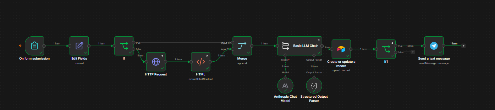
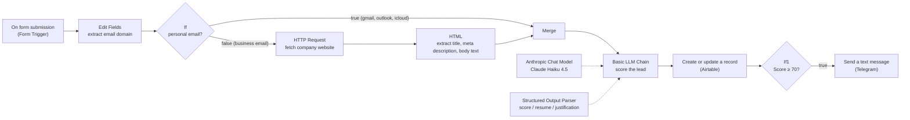

# CMR Prospect – AI Lead Qualification with n8n

An n8n workflow that collects leads through a form, enriches them with data from their company website, scores them out of 100 with Claude, stores them in Airtable and pings you on Telegram when a hot lead comes in.



---

## How it works



1. **On form submission** – An n8n form collects the lead's first name, last name, email, company, job title and need.
2. **Edit Fields** – Extracts the domain from the email address.
3. **If** – Routes personal email domains (`gmail.com`, `outlook.com`, `icloud.com`) straight to the scoring step, and business emails to the enrichment branch.
4. **HTTP Request → HTML** – Visits `https://<domain>` and extracts the page title, the `meta description` and the body text (scripts and styles excluded). Both nodes are set to *continue on error*, so an unreachable website does not stop the workflow.
5. **Merge → Basic LLM Chain** – Claude (via the **Anthropic Chat Model** node) scores the lead out of 100 on four criteria:

   | Criterion      | Points |
   | -------------- | -----: |
   | Need           |     30 |
   | Job title      |     25 |
   | Company size   |     25 |
   | Industry       |     20 |

   The **Structured Output Parser** enforces a JSON response containing a `score`, a short `resume` (summary for the sales team) and a one-sentence `justification`. When no website data is available, the prompt instructs the model to rely on the form only and not to invent company information.
6. **Create or update a record** – Saves the lead and the AI output to an Airtable table, matching on `Email`: a lead who submits the form twice updates their existing record instead of creating a duplicate.
7. **If1 → Send a text message** – If the score is **≥ 70**, a Telegram notification is sent with the lead's name, position, company, score and summary.

## Features

- **Hosted lead form** – Built-in n8n Form Trigger, no external form tool needed.
- **Automatic website enrichment** – The company domain is derived from the email and the homepage is scraped for context.
- **Personal email handling** – Leads using Gmail, Outlook or iCloud addresses skip the website lookup and are scored on form data only.
- **Resilient to unreachable websites** – HTTP and HTML errors are ignored; the lead is still scored and saved.
- **AI scoring with Claude** – Four weighted criteria, conservative by design (no points awarded for missing information).
- **Structured output** – Score, summary and justification are parsed as JSON and mapped directly to Airtable fields.
- **CRM storage in Airtable** – Every lead is recorded with its score and AI analysis, deduplicated by email.
- **Hot lead alerts** – Instant Telegram message for leads scoring 70 or more.

## Prerequisites

- [Node.js](https://nodejs.org/) **20+**
- [n8n](https://n8n.io/) (self-hosted, installed via npm – see below)
- An **Anthropic API key** – [console.anthropic.com](https://console.anthropic.com/)
- An **Airtable** account with a **Personal Access Token** that has the following scopes:
  - `data.records:read`
  - `data.records:write`
  - `schema.bases:read`

  and access to the base containing your `Prospects` table.
- A **Telegram bot** – create one with [@BotFather](https://t.me/BotFather) and note its token, plus the chat ID that should receive notifications.

## Installation

### 1. Install and start n8n

```bash
npm install -g n8n
n8n start
```

n8n is then available at <http://localhost:5678>.

### 2. Import the workflow

1. In n8n, create a new workflow.
2. Open the **⋯** menu (top right) → **Import from File…**
3. Select `CMR prospect.json` from this repository.

### 3. Configure credentials

| Node | Credential | What to provide |
| ---- | ---------- | --------------- |
| **Anthropic Chat Model** | Anthropic API | Your Anthropic API key |
| **Create or update a record** | Airtable Personal Access Token | Your PAT, then select your base and the `Prospects` table |
| **Send a text message** | Telegram API | Your bot token, then set the **Chat ID** field to your own chat ID |

Then:

1. Create the Airtable table described in [Airtable schema](#airtable-schema).
2. Open the **Basic LLM Chain** prompt and adapt it to your business (see [Customization](#customization)).
3. Save and activate the workflow. The form URL is shown in the **On form submission** node.

### Troubleshooting (Windows)

#### `n8n.ps1 cannot be loaded because running scripts is disabled on this system`

PowerShell's default execution policy blocks the npm-generated script. Allow locally installed scripts for your user:

```powershell
Set-ExecutionPolicy -Scope CurrentUser -ExecutionPolicy RemoteSigned
```

Alternatively, run `n8n.cmd start` or use Command Prompt (`cmd.exe`) instead of PowerShell.

#### `SQLite package has not been found installed`

The native `sqlite3` binary was not built during installation. Rebuild it from inside n8n's installation folder:

```powershell
cd "$env:APPDATA\npm\node_modules\n8n\node_modules\sqlite3"
npm run install
```

Then start n8n again. If the folder does not exist at this path, run `npm root -g` to find your global `node_modules` directory.

## Airtable schema

Create a table named **Prospects** with the following fields. The last column indicates which fields are written by the workflow; the others are computed by Airtable or maintained manually by the sales team.

| Field | Type | Filled by workflow |
| ----- | ---- | :----------------: |
| Nom complet | Formula (e.g. `{Prénom} & " " & {Nom}`) | – |
| Prénom | Single line text | ✅ |
| Nom | Single line text | ✅ |
| Email | Email | ✅ |
| Entreprise | Single line text | ✅ |
| Poste | Single line text | ✅ |
| Besoin | Long text | ✅ |
| Domaine | Single line text | ✅ |
| Site web | URL | – |
| Description du site | Long text | ✅ |
| Score | Number | ✅ |
| Résumé IA | Long text | ✅ |
| Justification IA | Long text | ✅ |
| Type d'email | Single select (`Pro`, `Perso`) | – |
| Statut | Single select (`Nouveau`, `À rappeler`, `En cours`, `Gagné`, `Perdu`) | – |
| Prospect chaud | Formula (e.g. `IF({Score} >= 70, "🔥", "")`) | – |
| Date de réception | Created time | – |

## Customization

### Scoring criteria

The scoring logic lives entirely in the prompt of the **Basic LLM Chain** node, under `## Critères de notation`. You can:

- change the weight of each criterion (keep the total at 100),
- rewrite the description of a criterion,
- replace the example industries in the *Secteur* criterion with the ones you target,
- add or remove criteria.

If you change the fields returned by the model, update the JSON example in the **Structured Output Parser** node and the field mapping in **Create or update a record** accordingly.

### Hot lead threshold

The threshold is set in the **If1** node (`{{ $json.fields.Score }}` *is greater than or equal to* `70`). Change `70` to make notifications more or less selective. If you use the `Prospect chaud` formula in Airtable, update it to match.

### Personal email domains

The list of personal domains is an expression in the **If** node:

```js
["gmail.com", "outlook.com", "icloud.com"].includes($json.Domaine)
```

Add any other providers you want to exclude from website enrichment (e.g. `hotmail.com`, `yahoo.com`).

### Model

The **Anthropic Chat Model** node uses Claude Haiku 4.5 by default. You can switch to another Claude model from the node's model list.

## Roadmap

- [ ] **Slack notification** – Send hot lead alerts to a Slack channel in addition to (or instead of) Telegram.
- [ ] **Direct Airtable link** – Include a link to the lead's Airtable record in the notification.
- [ ] **Online hosting** – Deploy n8n on a server or n8n Cloud so the form is publicly reachable 24/7.

## License

This project is licensed under the [MIT License](LICENSE).
